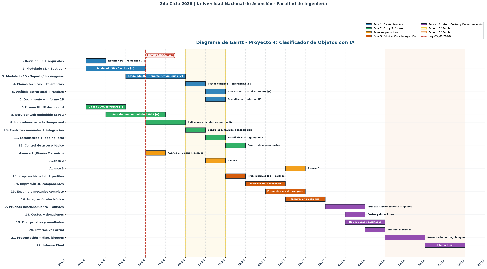
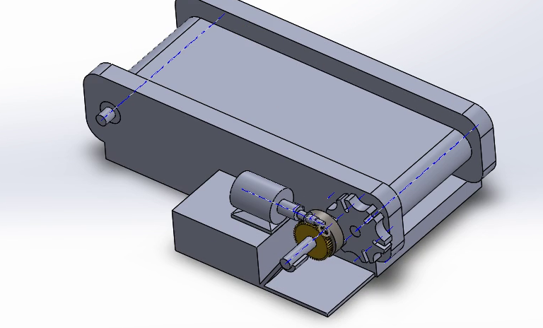
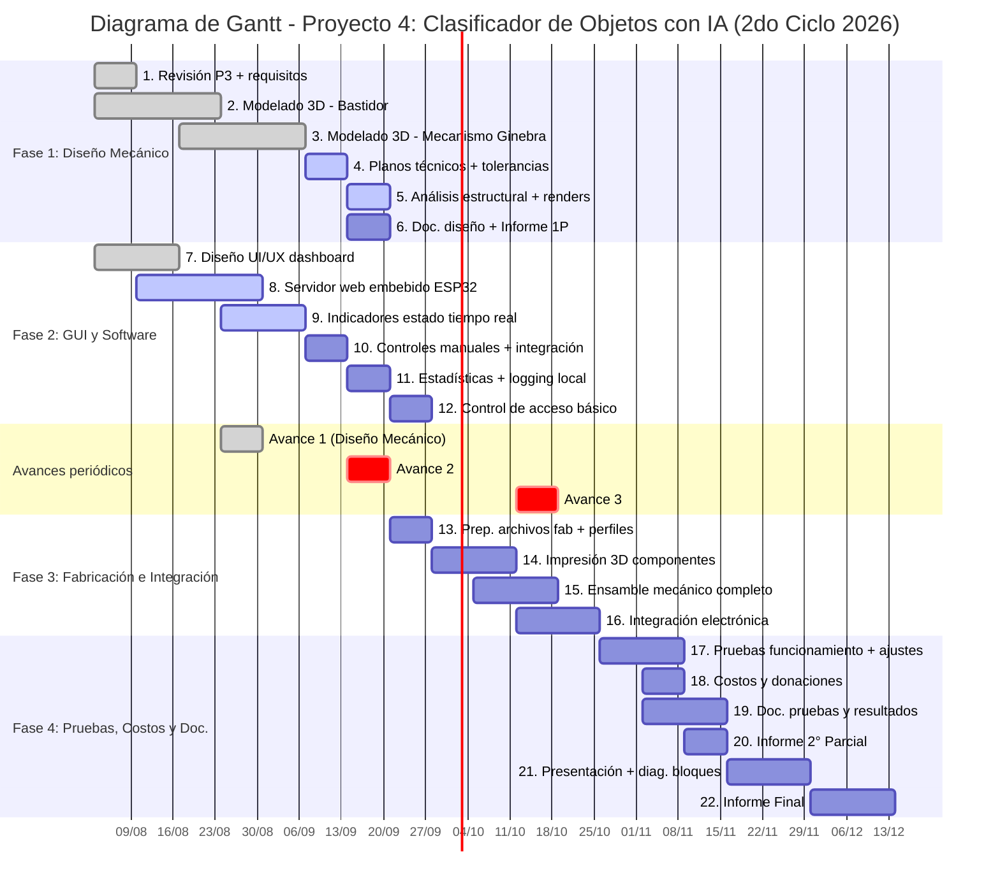

# Diagrama de Gantt y Estado de Avances - Proyecto 4: Clasificador de Objetos con IA
**2do Ciclo 2026 | Universidad Nacional de Asunción - Facultad de Ingeniería (FIUNA)**

> **Fecha de corte de avance / Hoy:** 24 de Agosto de 2026

---

## 🎨 Leyenda de Fases y Símbolos

| Color / Estilo | Significado | Descripción |
| :--- | :--- | :--- |
| 🔵 **Azul** | **Fase 1: Diseño Mecánico** | CAD, bastidor, sinfín-corona, mecanismo de Ginebra, planos y FEA. |
| 🟢 **Verde** | **Fase 2: GUI y Software** | Dashboard web embebido en ESP32-S3, indicadores RT, controles y accesos. |
| 🟡 **Amarillo / Dorado** | **Avances periódicos** | Hitos de presentación de avances académicos (Avance 1, 2 y 3). |
| 🟠 **Naranja** | **Fase 3: Fabricación e Integración** | Impresión 3D (PLA/PETG), ensamble de Ginebra, perfilería y cableado. |
| 🟣 **Violeta** | **Fase 4: Pruebas, Costos y Doc.** | Pruebas operativas, optimizaciones, informes parciales y presentación final. |
| 🟡 *Fondo Amarillo* | **Período 1° Parcial** | Ventana de evaluaciones parciales (07/09/2026 - 21/09/2026). |
| 🟠 *Fondo Salmón* | **Período 2° Parcial** | Ventana de evaluaciones parciales (16/11/2026 - 14/12/2026). |
| `[✓]` | **Estado: Completado** | Tarea finalizada al 100%. |
| `[▶]` | **Estado: En Progreso** | Tarea en desarrollo activo a la fecha de corte. |

---

## 📊 Tabla de Tareas y Cronograma Detallado

| # | Tarea / Actividad | Fase | Inicio | Fin | Duración | Estado |
|---|-------------------|------|--------|-----|----------|:------:|
| 1 | Revisión P3 + requisitos | Diseño Mecánico | 03/08/2026 | 10/08/2026 | 1 sem | `[✓] Completado` |
| 2 | Modelado 3D - Bastidor y Transmisión | Diseño Mecánico | 03/08/2026 | 24/08/2026 | 3 sem | `[✓] Completado` |
| 3 | Modelado 3D - Mecanismo Ginebra / Guías | Diseño Mecánico | 17/08/2026 | 07/09/2026 | 3 sem | `[✓] Completado` |
| 4 | Planos técnicos + tolerancias | Diseño Mecánico | 07/09/2026 | 14/09/2026 | 1 sem | `[▶] En Progreso` |
| 5 | Análisis estructural + renders | Diseño Mecánico | 14/09/2026 | 21/09/2026 | 1 sem | `[▶] En Progreso` |
| 6 | Doc. diseño + Informe 1P | Diseño Mecánico | 14/09/2026 | 21/09/2026 | 1 sem | Pendiente |
| 7 | Diseño UI/UX dashboard | GUI y Software | 03/08/2026 | 17/08/2026 | 2 sem | `[✓] Completado` |
| 8 | Servidor web embebido ESP32 | GUI y Software | 10/08/2026 | 31/08/2026 | 3 sem | `[▶] En Progreso` |
| 9 | Indicadores estado tiempo real | GUI y Software | 24/08/2026 | 07/09/2026 | 2 sem | `[▶] En Progreso` |
| 10 | Controles manuales + integración | GUI y Software | 07/09/2026 | 14/09/2026 | 1 sem | Pendiente |
| 11 | Estadísticas + logging local | GUI y Software | 14/09/2026 | 21/09/2026 | 1 sem | Pendiente |
| 12 | Control de acceso básico | GUI y Software | 21/09/2026 | 28/09/2026 | 1 sem | Pendiente |
| - | **Avance 1 (Diseño Mecánico)** | Avances periódicos | 24/08/2026 | 31/08/2026 | 1 sem | `[✓] Completado` |
| - | **Avance 2** | Avances periódicos | 14/09/2026 | 21/09/2026 | 1 sem | Pendiente |
| - | **Avance 3** | Avances periódicos | 12/10/2026 | 19/10/2026 | 1 sem | Pendiente |
| 13 | Prep. archivos fab + perfiles | Fabricación e Integración | 21/09/2026 | 28/09/2026 | 1 sem | Pendiente |
| 14 | Impresión 3D componentes | Fabricación e Integración | 28/09/2026 | 12/10/2026 | 2 sem | Pendiente |
| 15 | Ensamble mecánico completo | Fabricación e Integración | 05/10/2026 | 19/10/2026 | 2 sem | Pendiente |
| 16 | Integración electrónica | Fabricación e Integración | 12/10/2026 | 26/10/2026 | 2 sem | Pendiente |
| 17 | Pruebas funcionamiento + ajustes | Pruebas, Costos y Doc. | 26/10/2026 | 09/11/2026 | 2 sem | Pendiente |
| 18 | Costos y donaciones | Pruebas, Costos y Doc. | 02/11/2026 | 09/11/2026 | 1 sem | Pendiente |
| 19 | Doc. pruebas y resultados | Pruebas, Costos y Doc. | 02/11/2026 | 16/11/2026 | 2 sem | Pendiente |
| 20 | Informe 2° Parcial | Pruebas, Costos y Doc. | 09/11/2026 | 16/11/2026 | 1 sem | Pendiente |
| 21 | Presentación + diag. bloques | Pruebas, Costos y Doc. | 16/11/2026 | 30/11/2026 | 2 sem | Pendiente |
| 22 | Informe Final | Pruebas, Costos y Doc. | 30/11/2026 | 14/12/2026 | 2 sem | Pendiente |

---

## 🛠️ Avances del Proyecto — Diseño Mecánico Formal (`Machine Design LAB`)

En cumplimiento con la entrega del **Avance 1 (24/08/2026)**, se presenta la integración completa del modelo CAD oficial ubicado en la carpeta **`Machine Design LAB`**:

### 1. Sistema de Transmisión por Tornillo Sinfín y Corona (100% Completado)
- **Tornillo Sinfín (`worm.SLDPRT`) y Corona (`gear.SLDPRT`):** Reducción de velocidad de rotación del motor eléctrico (`motor.SLDPRT`) acoplada mecánicamente, garantizando auto-frenado e imposibilidad de retroceso por inercia.

### 2. Mecanismo de Ginebra / Cruz de Malta de 6 Posiciones (100% Completado)
- **Rueda de Ginebra (`Geneva_wheel.SLDPRT`):** Mecanismo de 6 ranuras radiales acoplado directamente al eje impulsor (`shaft.SLDPRT`) del rodillo de la cinta transportadora (`conveyor roller.SLDPRT`).
- **Indexación Intermitente Pasos-Pausas:** Convierte el giro continuo del motor en un movimiento de transporte paso a paso con **pausas automáticas de $0.67\text{ s}$**. Durante la pausa, la cámara OV5640 captura la imagen del objeto inmóvil sin desenfoque antes del procesamiento por la IA.

### 3. Informe Técnico de Ingeniería Mecánica
Consulte la documentación y cálculos completos en:
👉 **[Informe_Diseno_Estructural_Mecanico.md](file:///c:/Users/Sol%20Fernandez/.antigravity/Clasificador%20de%20objetos/Hardware/Diseno_Mecanico/Informe_Diseno_Estructural_Mecanico.md)**

---

## 💻 Diagrama de Gantt en Mermaid (Código fuente)

---

## 📌 Notas Adicionales
- **Período 1° Parcial**: Aproximadamente del **07/09/2026 al 21/09/2026**.
- **Período 2° Parcial**: Aproximadamente del **16/11/2026 al 14/12/2026**.
- **Visualizador online de Mermaid:** [mermaid.live](https://mermaid.live)
