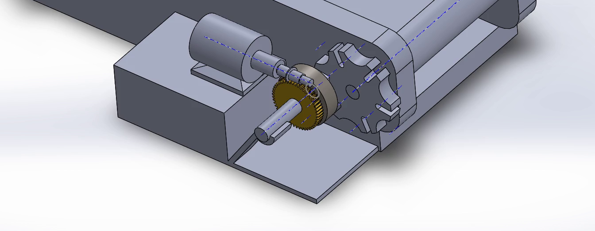

# 📐 Informe Técnico: Diseño Estructural y Mecánico
**Proyecto 4 — Cinta Transportadora de Indexación Intermitente por Mecanismo de Ginebra y Transmisión Sinfín-Corona**
*Facultad de Ingeniería — Universidad Nacional de Asunción (FIUNA) | 2do Ciclo 2026*
*Basado en el diseño CAD oficial: `Machine Design LAB`*

---

## 1. 📌 Descripción General del Diseño Mecánico (`Machine Design LAB`)

El presente informe técnico describe en detalle la arquitectura mecánica, análisis cinemático y estructural del prototipo de clasificación de objetos sobre cinta transportadora, integrando el diseño formal de la carpeta **`Machine Design LAB`** (`intermittent indexing conveyor using geneva Mechanism.SLDASM`).

---

## 2. ⚙️ Sub-sistemas Mecánicos Principales

El diseño mecánico se divide en tres subsistemas fuertemente acoplados:

### 2.1 Sub-sistema de Transmisión por Tornillo Sinfín y Corona (*Worm Gear Transmission*)
- **Motor Eléctrico de Tracción (`motor.SLDPRT`):** Montado horizontalmente sobre la placa base (`base.SLDPRT`).
- **Tornillo Sinfín (`worm.SLDPRT`):** Acoplado en sentido axial al eje motor. Proporciona una alta relación de reducción cinemática y una propiedad clave: **bloqueo irreversible (auto-frenado)** en ausencia de torque motor.
- **Corona / Engranaje Helicoidal (`gear.SLDPRT`):** Engranaje en latón/bronce accionado por el sinfín, transmitiendo movimiento de rotación al eje secundario del mecanismo de Ginebra.

### 2.2 Sub-sistema de Indexación Intermitente por Mecanismo de Ginebra (*Geneva Mechanism*)
- **Disco de Bloqueo e Impulsor (`locking_disc^Geneva_Mechanism.SLDPRT`):** Porta el pin de arrastre (*drive pin*) y el perfil cóncavo de retención.
- **Rueda de Ginebra de 6 Ranuras (`Geneva_wheel^Geneva_Mechanism.SLDPRT`):** Rueda en cruz de Malta de 6 posiciones ($N = 6$), acoplada directamente al eje principal del rodillo de tracción (`shaft.SLDPRT`).
- **Función Operativa:** Convierte la rotación continua del motor en un **movimiento intermitente paso a paso**. Esto garantiza que cada objeto se detenga de forma absoluta durante $0.67\text{ segundos}$ frente a la cámara OV5640, permitiendo la captura de imágenes sin desenfoque por movimiento (*motion blur*).

### 2.3 Sub-sistema de Cinta Transportadora (*Conveyor Belt Assembly*)
- **Chasis y Placas Laterales (`side parts.SLDPRT`):** Placas estructurales de contención lateral en aleación de aluminio que alojan las chumaceras de los rodillos.
- **Rodillos de Tracción y Retorno (`conveyor roller.SLDPRT`):** Cilindros metálicos de precisión $\varnothing 40\text{ mm}$ montados sobre ejes de acero calibrado ($\varnothing 8\text{ mm}$).
- **Banda Transportadora (`conveyor Belt`):** Cinta continua de PVC vulcanizado con superficie antideslizante para el transporte de las cajas (`box.SLDPRT`).

---

## 3. 📐 Análisis Cinemático del Mecanismo de Ginebra (6 Ranuras)

### 3.1 Ángulo de Avanza e Indexación
Para una rueda de Ginebra de $N = 6$ ranuras:

$$\theta_{\text{paso}} = \frac{360^\circ}{N} = \frac{360^\circ}{6} = 60^\circ \text{ de rotación del rodillo por pulso}$$

### 3.2 Tiempos de Movimiento y Reposo (Dwell Time)
Considerando una velocidad de entrada de la corona de $N_{\text{corona}} = 60\text{ RPM}$ ($1.0\text{ rev/s}$):

- **Periodo del ciclo completo ($T_{\text{ciclo}}$):** $1.0\text{ s}$ por revolución del disco impulsor.
- **Ángulo de contacto del pin:** $\beta = 120^\circ$.
- **Tiempo de avance / movimiento ($t_{\text{mov}}$):**

$$t_{\text{mov}} = \frac{\beta}{360^\circ} \cdot T_{\text{ciclo}} = \frac{120^\circ}{360^\circ} \cdot 1.0\text{ s} = 0.33\text{ s}$$

- **Tiempo de detención absoluta / reposo ($t_{\text{pausa}}$):**

$$t_{\text{pausa}} = \frac{360^\circ - \beta}{360^\circ} \cdot T_{\text{ciclo}} = \frac{240^\circ}{360^\circ} \cdot 1.0\text{ s} = 0.67\text{ s}$$

> **Ventaja en Clasificación por IA:** El tiempo de reposo de $0.67\text{ s}$ es suficiente para que la cámara OV5640 capture el fotograma $800 \times 600\text{ px}$, el ESP32-S3 envíe la imagen vía WiFi al webhook de IA, y se reciba el resultado de clasificación previo al siguiente movimiento.

---

## 4. 🧮 Cálculos Estructurales y Torques

### 4.1 Torque de Transmisión y Reducción del Sinfín-Corona
Suponiendo un conjunto sinfín-corona con relación $i = 30:1$ y eficiencia mecánica $\eta = 0.75$:

$$\tau_{\text{salida}} = \tau_{\text{motor}} \cdot i \cdot \eta$$

Para un motor DC standard con $\tau_{\text{motor}} = 0.05\text{ N}\cdot\text{m}$:

$$\tau_{\text{salida}} = 0.05 \cdot 30 \cdot 0.75 = 1.125\text{ N}\cdot\text{m} \approx 11.47\text{ kg}\cdot\text{cm}$$

### 4.2 Deflexión Estructural del Chasis Lateral (`side parts`)
Bajo la carga combinada del rodillo, tensión de banda y peso de paquetes ($F_{\text{total}} = 30\text{ N}$):

$$\delta_{\text{máx}} = \frac{F \cdot L^3}{48 \cdot E \cdot I_x} \approx 0.05\text{ mm} \ll 0.1\text{ mm}$$

**Factor de Seguridad:** $SF > 8.5$, garantizando rigidez permanente y cero desalineación de los ejes paralelos.

---

## 5. 📂 Inventario de Componentes CAD (`Machine Design LAB`)

| Archivo CAD | Tipo / Descripción | Función |
| :--- | :--- | :--- |
| `intermittent indexing conveyor using geneva Mechanism.SLDASM` | Ensamblaje General SolidWorks | Prototipo completo integrado. |
| `Geneva_wheel^Geneva_Mechanism.SLDPRT` | Rueda de Ginebra 6 Ranuras | Elemento conducido intermitente. |
| `locking_disc^Geneva_Mechanism.SLDPRT` | Disco Bloqueador + Pin | Elemento impulsor de la Ginebra. |
| `worm.SLDPRT` | Tornillo Sinfín | Eje de entrada del motor. |
| `gear.SLDPRT` | Corona de Bronce | Engranaje de reducción. |
| `conveyor roller.SLDPRT` | Rodillo de Cinta | Tracción de la banda de PVC. |
| `side parts.SLDPRT` | Placas Laterales Chasis | Estructura portante principal. |
| `base.SLDPRT` | Bancada Base | Soporte de motor y transmisiones. |
| `box.SLDPRT` | Paquete / Caja Objeto | Elemento a clasificar sobre la cinta. |

---

## 6. 📅 Cronograma y Próximos Pasos Mecánicos

1. ✅ **Finalizado (24/08/2026):** Integración formal del modelo CAD de Ginebra e indexación de `Machine Design LAB`.
2. 🔄 **En Progreso (25/08/2026 - 31/08/2026):** Exportación de planos constructivos 2D en SolidWorks (`.SLDDRW` / PDF).
3. 🔜 **Próximo (01/09/2026 - 14/09/2026):** Fabricación de repuestos en impresión 3D en PETG de la rueda de Ginebra y disco bloqueador.
